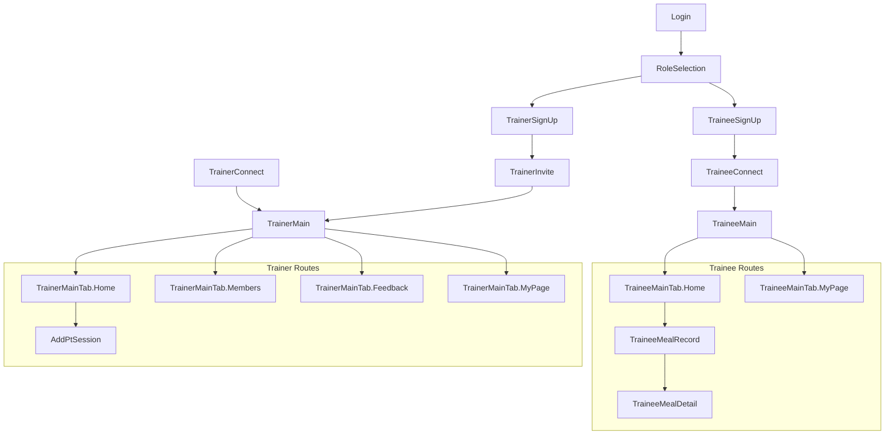

# TnT (Trainer & Trainee)  

> 트레이너, 트레이니를 위한 PT 통합 관리 서비스


## 🛠️ Spec
- `Clean Architecture`
- `MVI`
- `Hilt`
- `Coroutines`
- `Jetpack Compose`
- `Retrofit2`
- `DataStore`
- `Serialization`
- `Coil`
- `FCM`
- `Ktlint`, `Detekt`

## 🚙 Navigation Structure



## 📦 Package Structure
```
App
├── build-logic/                   
├── domain/                        
├── data/                          
│   ├── network/  
│   ├── storage/  
│   ├── repository/  
│   └── session/  
├── core/                          
│   ├── designsystem/  
│   ├── navigation/  
│   ├── ui/  
│   └── login/  
├── feature/                       
│   ├── main/  
│   ├── login/  
│   ├── roleselect/  
│   ├── webview/  
│   ├── trainer/                   
│   │   ├── signup/  
│   │   ├── connect/  
│   │   ├── invite/  
│   │   ├── main/  
│   │   ├── home/  
│   │   ├── feedback/  
│   │   ├── members/  
│   │   ├── mypage/  
│   │   ├── notification/  
│   │   ├── addptsession/  
│   │   └── modifymyinfo/  
│   └── trainee/                   
│       ├── signup/  
│       ├── connect/  
│       ├── main/  
│       ├── home/  
│       ├── mypage/  
│       ├── notification/  
│       ├── mealrecord/  
│       ├── mealdetail/
│       └── modifymyinfo/
└── gradle/  
    └── libs.versions.toml         
```
